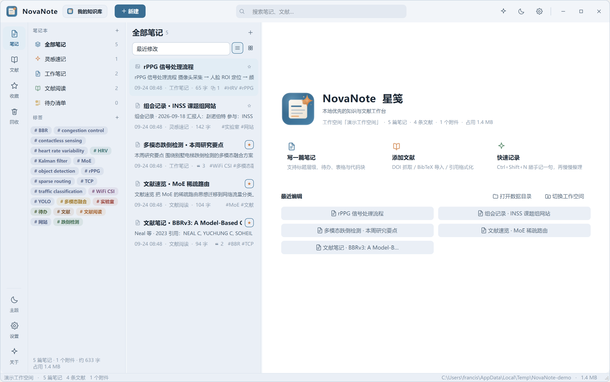
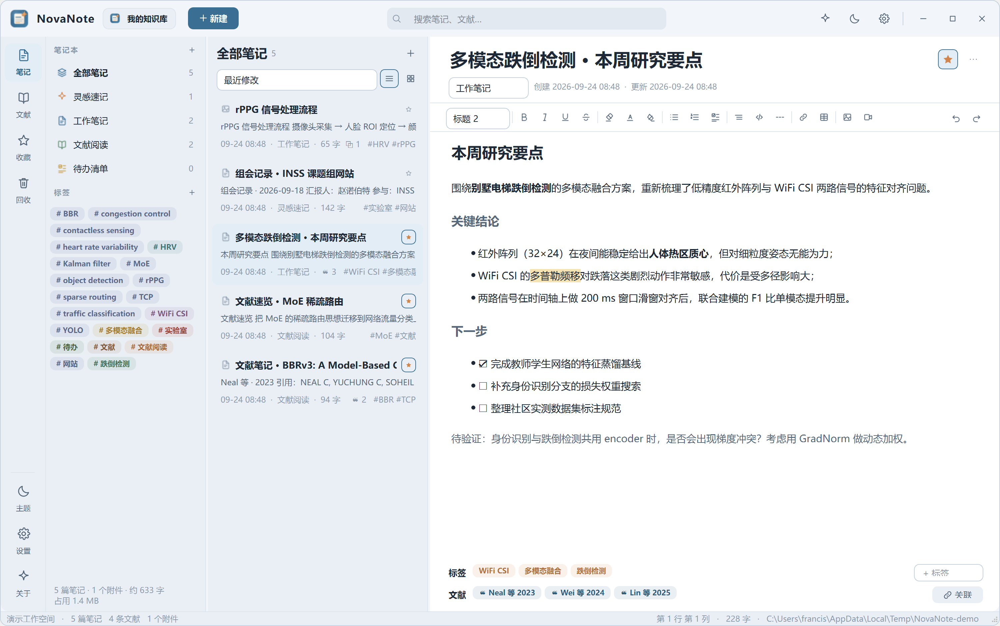
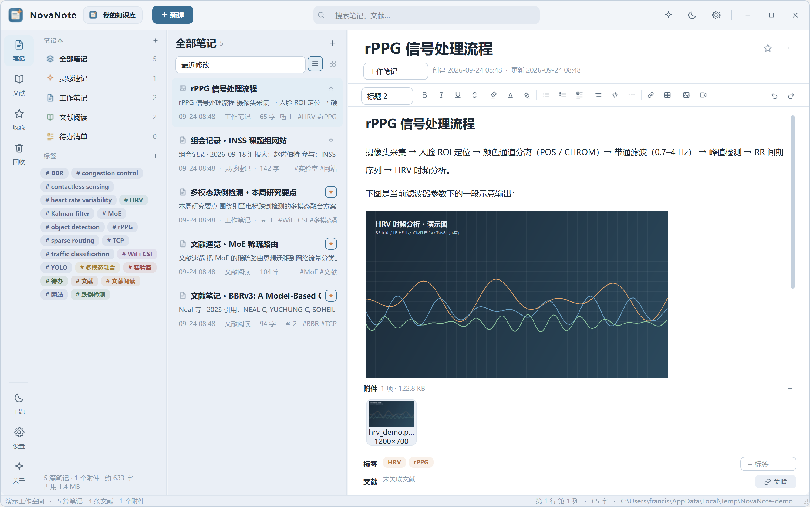
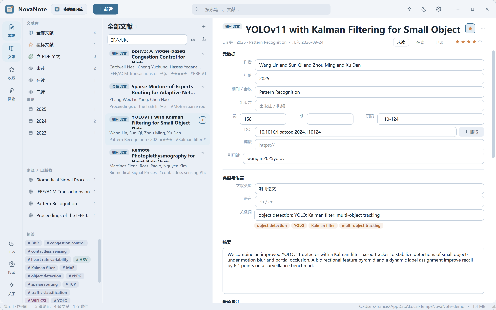
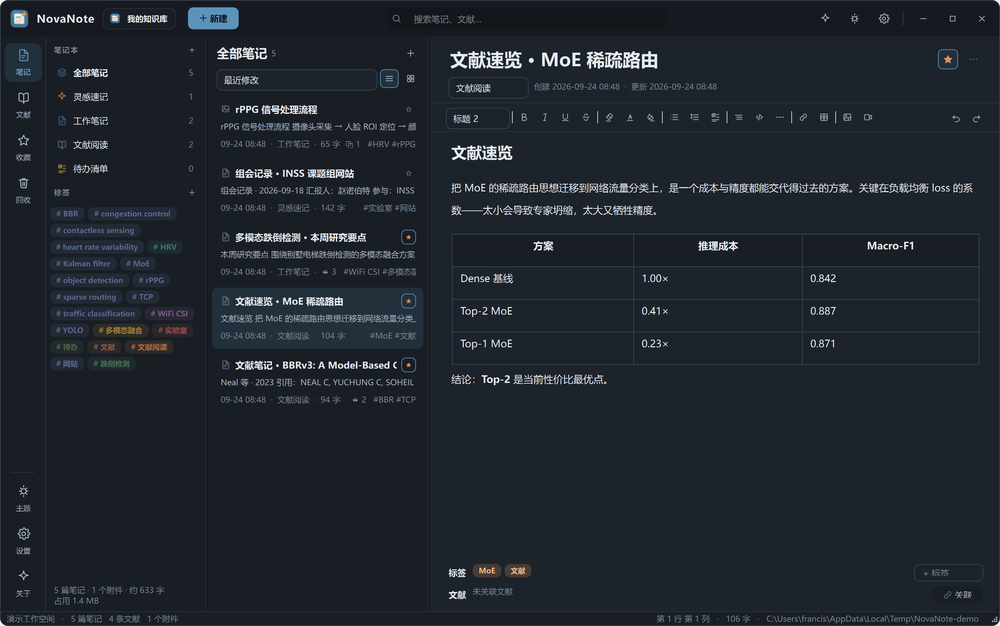
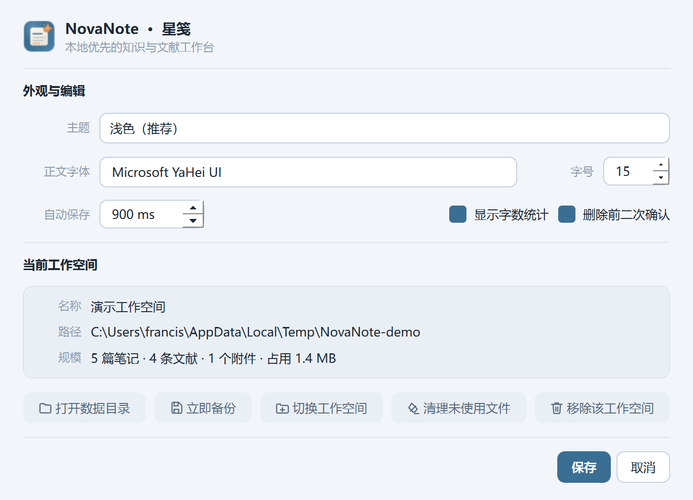
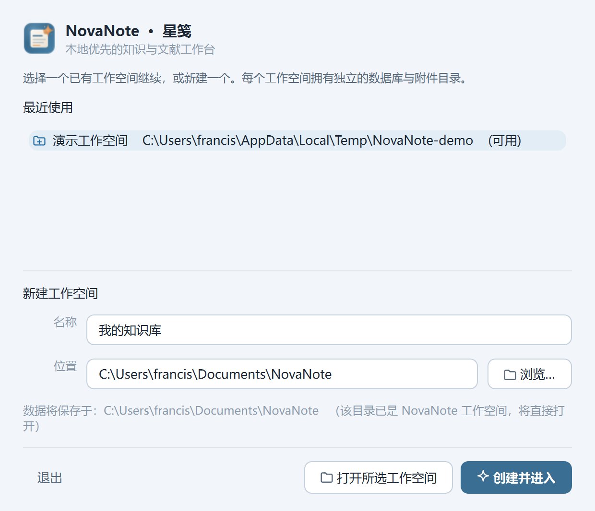
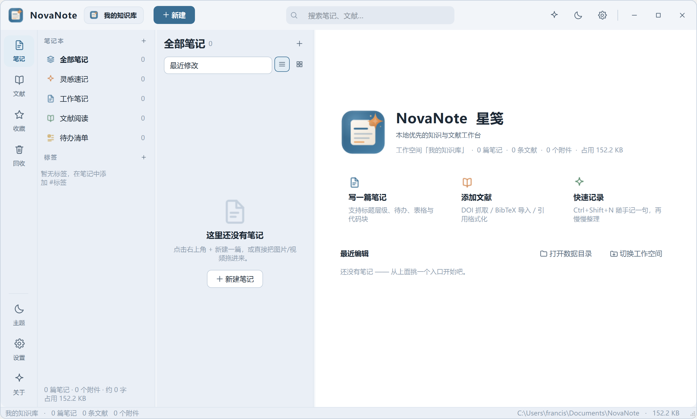
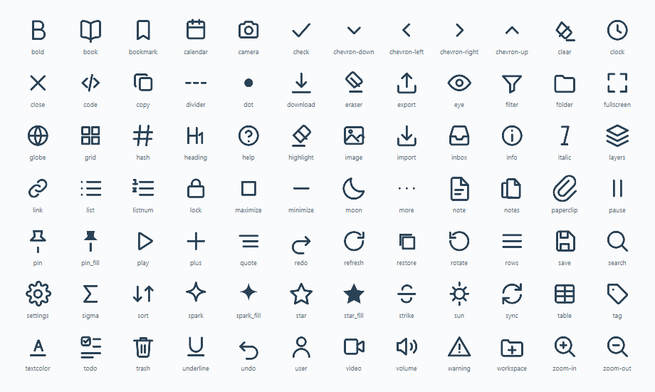

# NovaNote · 星笺

> 本地优先的知识与文献工作台 —— 把日常速记、图文视频素材与学术文献收进同一个安静的工作台。


NovaNote 是一款基于 **Python + PySide6 (Qt 6)** 的桌面笔记软件，参照印象笔记的信息架构（笔记本 / 标签 / 列表 / 编辑器），并针对**学术研究场景**做了专门扩展：文献元数据管理、BibTeX 导入导出、DOI 自动抓取、APA / GB/T 7714 引用格式化、PDF 全文关联、笔记与文献双向绑定。

所有数据保存在你自己的磁盘上，不依赖账号与网络。

---

## 界面预览

| 工作台概览 | 富文本编辑器 |
| --- | --- |
|  |  |
| **正文内联图片** | **文献管理** |
|  |  |
| **深色主题** | **设置与工作空间** |
|  |  |

首次启动的工作空间向导：



实际运行时的窗口（由 `python tools/shot_window.py` 抓取，非演示数据）：



> `01`–`07` 由 `python tools/screenshot.py` 自动生成，脚本会搭建一个临时演示工作空间
> （含笔记、图片附件、4 条文献与标签）；`08` 抓的是**你此刻正在用的那个窗口**。

---

## 一、特性总览

### 1. 日常笔记（文字 / 图片 / 视频）

| 能力 | 说明 |
| --- | --- |
| 富文本编辑 | 标题 1–3 级、正文、引用块、代码块、加粗/斜体/下划线/删除线、高亮、文字颜色、有序/无序列表、待办勾选、表格、分割线、超链接 |
| 图片 | 拖拽、粘贴截图、工具栏插入；自动压缩为缩略图，正文内联显示，可缩放查看 |
| 视频 | 拖入即归档为附件，内置播放器（播放/暂停、进度拖拽、音量、方向键快进退） |
| 大图查看 | 灯箱模式：滚轮缩放、适应窗口、旋转 90° |
| 组织 | 笔记本（可自定义图标与配色）+ 标签（彩色标签片）+ 星标 + 回收站 |
| 检索 | 标题与正文全文检索，跨笔记本、跨标签 |
| 自动保存 | 输入停止后自动落库（间隔可在设置中调整），标题栏下角实时提示 |
| 导出 | Markdown / HTML（自带样式）/ PDF |
| 视图 | 列表视图与媒体网格视图一键切换 |

### 2. 学术文献管理

| 能力 | 说明 |
| --- | --- |
| 元数据 | 标题、作者（支持 `and` / `;` 多作者）、年份、期刊/会议、出版方、卷期页、DOI、URL、语言、摘要、备注、关键词、评分、阅读状态（未读/在读/已读）、引用键 |
| 导入 | BibTeX（`.bib`）批量导入、RIS（EndNote / Zotero 导出）导入、DOI 一键抓取（Crossref） |
| 导出 | 选中或全库导出为 BibTeX |
| 引用格式 | 一键生成并复制 **APA**、**GB/T 7714-2015**、**BibTeX** |
| 附件 | PDF / EPUB / 文档关联，双击用系统程序打开；支持在文件夹中定位 |
| 筛选 | 阅读状态、星标、含 PDF、年份、来源出版物、标签、关键词 |
| 与笔记联动 | 由文献一键生成文献笔记（自动写入引用、关键词、摘要与批注区）；笔记可反向关联多条文献 |

### 3. 工作空间

安装后首次启动即进入工作空间向导：

* 每个工作空间是**一个独立文件夹**，内含 `novanote.db`、`assets/`、`exports/`、`workspace.json`
* 可创建多个工作空间（例如「科研」「个人」），在标题栏下拉或设置中随时切换
* 支持一键备份到任意目录、打开数据目录、清理未引用文件
* 迁移 = 复制文件夹；备份 = 复制文件夹

---

## 二、快速开始

### 环境要求

* Python 3.10 – 3.13（推荐 3.12）
* Windows / macOS / Linux，Qt 6 支持桌面环境

### 安装与运行

```bash
cd NovaNote
python -m pip install -r requirements.txt     # 安装 PySide6
python main.py                                # 启动
```

Windows 用户也可直接双击 `run.bat`。

首次启动会弹出工作空间向导，填写名称并选择存放目录即可（默认 `~/Documents/NovaNote`）。

### 命令行参数

```bash
python main.py --workspace "D:/NovaNote/科研"   # 直接打开指定工作空间
python main.py --theme dark                    # 覆盖主题
python main.py --version
```

### 生成图标资源（可选）

仓库已包含生成好的图标；如需从 `logo.svg` 重新生成 PNG / ICO 与品牌图：

```bash
python tools/make_assets.py
```

---

## 三、快捷键

| 快捷键 | 功能 |
| --- | --- |
| `Ctrl + N` | 新建笔记 |
| `Ctrl + Shift + N` | 快速记录（轻量速记窗口） |
| `Ctrl + S` | 立即保存 |
| `Ctrl + K` / `Ctrl + F` | 聚焦搜索框 |
| `Ctrl + Shift + S` | 收藏 / 取消收藏当前笔记 |
| `Ctrl + B / I / U` | 加粗 / 斜体 / 下划线 |
| `Ctrl + Z / Y` | 撤销 / 重做 |
| `Ctrl + 1 / 2 / 3 / 4` | 切换 笔记 / 文献 / 收藏 / 回收站 |
| `Ctrl + Shift + L` | 新增文献条目 |
| `Ctrl + Shift + T` | 切换明暗主题 |
| `Esc` | 关闭媒体查看器 / 清空搜索 |
| `空格` / `←` `→` | 视频播放暂停 / 快退快进 5 秒 |

---

## 四、项目结构

```
NovaNote/
├── main.py                     启动入口（含首启工作空间向导）
├── requirements.txt
├── run.bat                      Windows 快捷启动
├── build_exe.py                 PyInstaller 打包脚本
├── tools/
│   ├── make_assets.py           从 SVG 生成 PNG / ICO / 品牌横幅
│   ├── make_icon_sheet.py       生成图标系统总览图（docs/icon_set.png）
│   ├── selftest.py              39 项数据层 / 解析 / 导出自检
│   ├── lint.py                  静态体检（查 compileall 查不出的漏导入）
│   ├── screenshot.py            搭建演示工作空间并自动生成界面截图
│   ├── bench.py                 数据层性能基准（列表 / 检索 / 解析 / 导出）
│   ├── bench_ui.py              界面性能基准（列表渲染 / 滚动 / 主题切换）
│   └── shot_window.py           抓取正在运行的窗口截图（含高分屏 DPI 处理）
├── docs/
│   ├── banner.png
│   ├── icon_set.png             图标参考表
│   └── screenshots/             界面截图（由 tools/screenshot.py 生成）
└── novanote/
    ├── config.py                全局路径与用户设置（config.json）
    ├── theme.py                 橘蓝双色设计令牌 + QSS 生成
    ├── icons.py                 24×24 SVG 图标库（运行时按主题着色）
    ├── database.py              SQLite 连接、建表与版本迁移
    ├── models.py                领域模型 Note / Notebook / Tag / Asset / Reference
    ├── assets/                  logo.svg / logo.ico / 多尺寸 PNG
    ├── services/
    │   ├── workspace.py         工作空间创建、打开、注册表
    │   ├── notes.py             笔记、笔记本、标签、附件、文献关联
    │   ├── literature.py        文献 CRUD、BibTeX 解析/生成、DOI 抓取
    │   ├── assets.py            附件导入、缩略图、视频首帧抓取
    │   └── export.py            Markdown / HTML / PDF 导出
    ├── widgets/
    │   ├── common.py            按钮、卡片、标签片、评分、空状态、Toast
    │   ├── card_list.py         按可视区惰性实例化卡片的列表控件
    │   └── flow_layout.py       流式布局（标签自动换行）
    └── ui/
        ├── main_window.py       主窗口与全部业务接线
        ├── titlebar.py          自定义标题栏（工作空间切换 / 搜索）
        ├── siderail.py          左侧导航栏
        ├── context_panel.py     笔记本、标签、文献筛选面板
        ├── note_list.py         笔记列表（列表 / 媒体网格）
        ├── note_editor.py       富文本编辑器 + 格式栏 + 附件区
        ├── literature.py        文献列表与详情
        ├── media_viewer.py      图片灯箱 / 视频播放器
        ├── welcome.py           工作台概览
        └── dialogs.py           工作空间向导、设置、关于、速记
```

---

## 五、数据与存储

```
<工作空间>/
├── novanote.db        SQLite 主库（笔记、标签、文献、附件索引）
├── workspace.json     工作空间元信息（名称、ID、时间）
├── assets/
│   ├── 2026/09/…      按年月归档的原始附件（文件名含内容指纹前 8 位，天然去重）
│   └── thumbs/        图片 / 视频缩略图
└── exports/           导出的 MD / HTML / PDF / BibTeX
```

* 数据库开启 WAL 模式与外键约束
* `schema_version` 驱动前向迁移，旧工作空间可平滑升级
* 设置文件位于 `%APPDATA%/NovaNote/config.json`（Windows）/ `~/.config/NovaNote/config.json`（Linux）
* 运行日志：`%APPDATA%/NovaNote/novanote.log`

---

## 六、打包为免安装程序

```bash
python -m pip install pyinstaller
python build_exe.py            # 产物在 dist/NovaNote/
python build_exe.py --onefile  # 单文件
```

---

## 七、设计说明

### 配色

品牌双色取「**黛蓝 × 陶橘**」，并将饱和度整体压制在 25%–45%，避免刺眼：

| 角色 | 浅色主题 | 深色主题 |
| --- | --- | --- |
| 主色（结构 / 主操作） | `#3A6E93` 黛蓝 | `#5C93BA` |
| 强调色（灵感 / 星标） | `#D0854C` 陶橘 | `#D9925C` |
| 背景 | `#F2F5F9` | `#161A20` |
| 面板 | `#EAEFF6` | `#191E25` |
| 正文 | `#1D2936` | `#E7ECF2` |

蓝色承担导航、选中态、主按钮；橘色只用于星标、灵感速记、高亮与关键强调，形成"冷静结构 + 一点温度"的观感。全部颜色集中定义在 `theme.py` 的 `TOKENS` 中，QSS 由 `build_qss()` 统一生成。

### Logo

`NovaNote` = **nova（新星爆发）** + **note（纸页）**。

徽章为深橘蓝渐变的圆角方块，内部是一页微微上扬的稿纸，右上角一枚四芒星火花——寓意"灵感落纸"。纸面用蓝、橘两组横线区分层级，右上角的折角为暖橘色，与星火呼应。图标为纯矢量，16px 到 512px 均清晰；`icons.py` 在运行时按当前主题重新着色整套线性图标，无需维护多套资源。

### 图标系统

全部 **84 个图标**以 24×24 SVG 路径定义在 `icons.py` 中，只有一套路径数据，颜色在运行时注入，因此明暗主题、强调色变化都不需要新资源：



设计规则：

* 统一 24×24 画布、1.7px 描边、圆头圆角连接，视觉重量一致
* 分 `_S`（描边风格，用于导航 / 操作）与 `_F`（填充风格，用于星标 / 图钉等状态）两组
* 描边属性**逐 path 内联**（而非写在根 `<svg>` 上）—— Qt 的 `QSvgRenderer` 不会把根元素的 `fill` / `stroke` 继承给子 `<path>`，否则闭合路径会被填充成黑块
* 渲染到带 `devicePixelRatio` 的 QPixmap 时**必须显式传入目标矩形** `renderer.render(painter, QRectF(0, 0, size, size))`；省略矩形会以 `painter.viewport()`（设备无关尺寸）为基准，导致图标被缩到左上角 1/4 区域

重新生成参考图：

```bash
python tools/make_icon_sheet.py          # docs/icon_set.png
python tools/make_icon_sheet.py --dark   # docs/icon_set_dark.png
```

---

## 八、性能

NovaNote 面向的是"长期积累的个人知识库"，因此列表刷新、检索与滚动都必须与数据量解耦。
仓库内置两个基准脚本，改动后可直接复测：

```bash
python tools/bench.py 2000 300        # 数据层：列表 / 检索 / 文献 / 解析
python tools/bench_ui.py              # 界面层：列表渲染 / 滚动 / 主题切换
```

### 界面：列表虚拟化

`QListWidget.setItemWidget()` 会为**每一条** item 常驻一个真实 QWidget。早期实现按笔记数
逐条建卡片，结果是：

| 笔记数 | 优化前 | 优化后 |
| --- | --- | --- |
| 100 | 1.7 s | 0.04 s |
| 600 | 10.3 s | 0.04 s |
| 1000 | 17.4 s | 0.04 s |
| 2000 | 进程被拖垮 | 0.05 s |

做法是把卡片实例化收进 `widgets/card_list.py::CardList`：item 只做占位（带 sizeHint 与 id），
卡片延后到滚动进入可视区时创建，滚远后释放。**控件数量因此只与视口高度有关（恒定约 230 个），
与列表长度无关。**

### 两个必须避免的 Qt 反模式

1. **不要对"还没有父控件"的 QLabel 调 `setVisible(True)`。**
   那会让它变成一个顶层窗口并创建原生窗口句柄（实测单卡约 27ms），紧接着被 layout
   收养时又要重新挂载（约 13ms）。构造子控件时一律传 `parent`，单卡成本可从
   **40ms 降到 0.5ms**。
2. **不要用 `setStyleSheet()` 表达卡片的选中态。**
   每次调用都会让 Qt 为整棵子树重新解析样式表并重跑级联匹配。改用动态属性 + 全局 QSS
   （`#NoteCard[sel="true"]`），仅在状态真正变化时才 `unpolish/polish`。

### 数据层

- 列表查询不取 `body_html` —— 卡片只用标题与正文前 160 字，正文按需在打开笔记时读取
- 侧栏笔记本计数改用 `GROUP BY` 一次统计，而不是每个笔记本跑一次相关子查询
- 补齐连接表的**反向索引**（`note_tags(tag_id)` / `ref_tags(tag_id)` / `note_refs(ref_id)`）
  与 `notes(notebook_id, is_trashed)`，`tags()` 从 8.1ms 降到 0.3ms

---

## 九、开发与自检

改完代码建议依次跑一遍，全部是秒级到数秒级：

| 命令 | 作用 |
| --- | --- |
| `python -m compileall -q novanote main.py tools` | 语法检查 |
| `python tools/lint.py` | **静态体检**：查 `compileall` 查不出的「漏导入」等问题 |
| `python tools/selftest.py` | 39 项功能自检（数据层 / BibTeX / HTML 往返 / 导出） |

### 为什么需要单独的 lint

Python 只在**运行到那一行**时才解析函数体内的名字。所以 `compileall`、
甚至 `import` 整个包，都发现不了「函数里引用了一个没导入的类名」——
直到用户真的点到那个按钮。本项目就曾因此让整条「快速记录」链路一用就崩
（`dialogs.py` 少导入 `QPlainTextEdit`，点击后才抛 `NameError`）。

`lint.py` 优先调用 pyflakes（判定最可靠，含作用域链分析），
未安装时自动降级为内置 AST 检查（零依赖，能识别闭包与类体作用域）：

```bash
pip install pyflakes -i https://pypi.tuna.tsinghua.edu.cn/simple   # 可选但推荐
python tools/lint.py          # 只报错误级问题（未定义名字等）
python tools/lint.py --all    # 连「未使用的导入」一起报
```

### 性能回归

改完列表 / 卡片相关代码后跑一遍，注意两条红线：
列表渲染耗时不随数据量增长、单卡构造保持亚毫秒。

```bash
python tools/bench.py 2000 300    # 数据层（同时造出基准工作空间）
python tools/bench_ui.py          # 界面层（依赖上一步的 %TEMP%/NovaNote-bench）
```

---

## 十、已知限制

* 视频缩略图依赖 Qt Multimedia 后端，导入视频时最多等待约 2.6 秒抓取首帧；极端编码格式可能无法生成缩略图（不影响播放）。
* 正文中的搜索为 SQLite `LIKE` 全文匹配，对中文按子串匹配（个人规模数据下响应即时）。
* DOI 抓取依赖 Crossref 公共 API，需要联网；离线时输入条目的功能不受影响。
